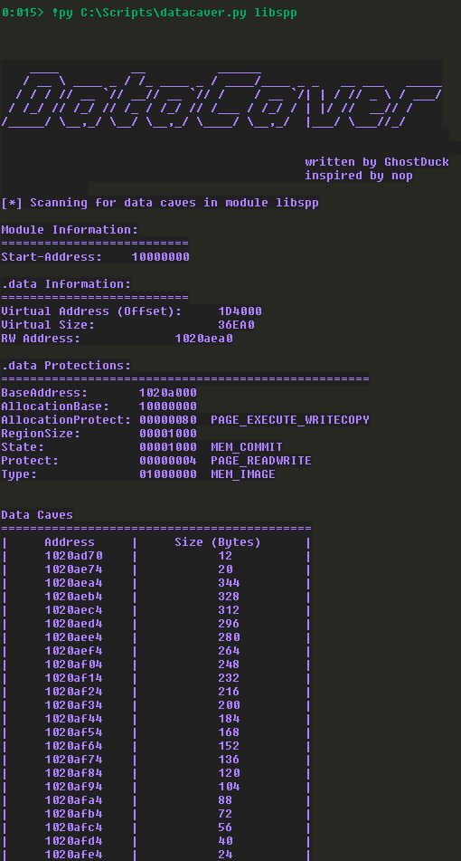

# Datacaver

## Description
This script automates the search process for a data cave in e.g. library files. 
It will look for empty memory regions and check if the region is protected with PAGE_READWRITE (0x04).

## Limitations
This script uses Python3 and Pykd to run within WinDbg. If you are unable to execute it inside WinDbg please consider using an older release; the preview version and the most recent version (10.0.22000.194 x86) are not working!

## Usage

If not already done place pykd.dll in `C:\Program Files\Windows Kits\10\Debuggers\x86\winext` (the path varies depending on your OS and WinDbg)

1) Load Pykd inside WinDbg: `.load pykd` 
2) Obtain a loaded module, e.g. by using `lm`
3) Execute the script: `!py C:\Scripts\datacaver.py <MODULE_NAME>`

    

